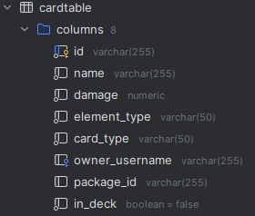
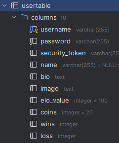

# Protokoll für mtcg 

## Design
This HTTP/REST-based server is built to be a platform for trading and battling with and against each other in a magical card-game world.

Design war eigentlich ja vorgegeben außer bei der Datenbank, ich habe einfach nur zwei Tables für den User und die Cards erstellt.

## Lessons Learned

Im Laufe des Projekts habe ich ein Verständnis für das Zusammenspiel von Controllern, Services und Repositories erlangt. Der Controller dient als erste Anlaufstelle für eingehende Anfragen, wo er die erforderlichen Werte vorbereitet. Anschließend leitet er die Verarbeitung an die Service-Schicht, welche für die Businesslogik und Überprüfungen zuständig ist. Das Repository hingegen widmet sich ausschließlich der Interaktionen mit der Datenbank.

## Unit Testing decisions

Ich habe ganz klein begonnen und mal die Repos ausprobiert damit ich eine Vorlage habe für andere Repos falls nötig.
Danach kam der Service dran um auch hier wieder eine Vorlage zu haben für weitere Services.
Zum Schluss durfte der Controller ran um zu schauen wie ich weitere Controller-Klassen aufbauen müsste.

## Unique Feature

Als Unique Feature habe ich die Passwörter der User gehashed abgespeichert.
Dies habe ich ganz einfach mit BCrypt gelöst.

## Tracked Time

12.01.24 ..... 10 Stunden

13.01.24 ..... 3 Stunden

14.01.24 ..... 5 Stunden

15.01.24 ..... 3 Stunden

17.01.24 ..... 8 Stunden

Insgesamt: 29 Stunden

## Link to git